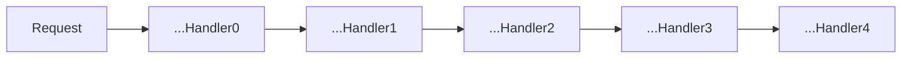

责任链路模式是一种行为性设计模式，主要用于将请求沿着一个链路传递，直到遇到能够处理请求的对象，从而实现请求与处理的解耦。在此过程中，每个对象都负责处理自己能够处理的部分，同时将不能处理的请求传递给下一个对象。

在 Rust 中，责任链路模式常常用于处理复杂的业务流程，例如处理各种校验、授权、流程等操作。该模式的核心思想是将各个业务处理逐层封装，从而实现灵活的扩展和调整。

责任链路模式示意图：



## 常用业务场景

在实际应用中，责任链路模式可以应用于许多业务场景，以下列举一些常见的场景：

- 网络请求中的拦截、校验、鉴权等操作；
- 表单提交时的校验、转换等操作；
- 货币兑换过程中的汇率转换、手续费计算等操作；
- 业务审核流程中的审核、审批等操作。


## 常见用法

在 Rust 中，可以使用不同的方式来实现责任链模式。以下是两种常见用法：

### 手动实现

手动实现常常使用枚举（Enum）来实现链路的不同节点，如下所示：

``` rust
enum Request {
    Get,
    Post(String),
    Delete,
}

trait Handler {
    fn handle(&mut self, req: Request);
}

struct GetHandler;
struct PostHandler {
    next: Option<Box<dyn Handler>>,
}
struct DeleteHandler;

impl Handler for GetHandler {
    fn handle(&mut self, req: Request) {
        match req {
            Request::Get => println!("Handled GET request."),
            _ => println!("Failed to handle request."),
        }   
    }
}

impl Handler for PostHandler {
    fn handle(&mut self, req: Request) {
        match req {
            Request::Post(data) => println!("Handled POST request with data: {}", data),
            _ => {
                if let Some(ref mut next) = self.next {
                    next.handle(req);
                } else {
                    println!("Failed to handle request.");
                }
            }
        }
    }
}

impl Handler for DeleteHandler {
    fn handle(&mut self, req: Request) {
        match req {
            Request::Delete => println!("Handled DELETE request."),
            _ => println!("Failed to handle request."),
        }
    }
}

fn main() {
    let mut get_handler = GetHandler {};
    let mut post_handler = PostHandler {
        next: Some(Box::new(DeleteHandler {})),
    };

    get_handler.handle(Request::Get);
    post_handler.handle(Request::Post("Some data".to_string()));
    post_handler.handle(Request::Delete);
}
```

### 使用框架支持

在 Rust 普及程度日益增加的情况下，开发者愈发趋向于使用轻量级的框架支持。例如，可以使用 Actix-Web 框架来实现简单的责任链路模式：

``` rust
use actix_web::{web, App, HttpServer, Responder};

fn index(info: web::Path<(String, u32)>) -> impl Responder {
    format!("Hello {}! id:{}", info.0, info.1)
}

fn main() -> std::io::Result<()> {
    HttpServer::new(|| {
        App::new()
            .service(
                web::resource("/{name}/{id}")
                    .route(web::get().to(index)),
            )
    })
        .bind("127.0.0.1:8080")?
        .run()
}
```

## 进阶用法

在实际的业务场景中，责任链路模式不仅仅只用于简单的校验、转换操作，还可以应用于更复杂的业务处理场景。以下是一些进阶用法：

### 异步处理

在 Rust 中，可以使用 async/await 和 tokio 等工具来实现异步处理。例如，以下代码片段展示了如何使用 async/await 和 tokio 实现异步处理：

``` rust
use std::sync::Arc;
use tokio::sync::oneshot;

#[tokio::main]
async fn main() {
    let (tx, mut rx) = oneshot::channel();
    let mut handler = AsyncHandler {};

    let request = Arc::new(Request::new());
    async {
        handler.handle(request.clone()).await;
        tx.send(request).unwrap();
    }.await;

    let result = rx.try_recv().unwrap();
}

struct AsyncHandler;

impl AsyncHandler {
    pub async fn handle(&mut self, req: Arc<Request>) {
        // async task
    }
}
```

### 处理链路的自动生成

在实现业务处理链路时，往往需要定义大量的对象，从而使代码变得复杂而且难以维护。在 Rust 中，可以使用 RustAST 来生成处理链路的代码：

``` rust
extern crate rustast;
use rustast::generate_handler_chain;

fn main() {
    let handler_chain = generate_handler_chain! {
        "用户名校验" => |req| -> Result<Request, UserError> {
            // ...
            Ok(req)
        },

        "密码校验" => |req| -> Result<Request, UserError> {
            // ...
            Ok(req)
 },

        "权限校验" => |req| -> Result<Request, UserError> {
            // ...
            Ok(req)
        },
        // ...
    };

    handler_chain.handle(Request::new());
}
```

## 最佳实践

以下是一些最佳实践：

- 对于处理顺序敏感的业务场景，应该明确定义每个处理节点的执行顺序；
- 应该根据具体情况决定何时使用手动实现或采用框架支持；
- 在使用框架支持时，应该遵从框架的约定，确保代码的可维护性和可扩展性；
- 在处理链路的设计过程中，应该考虑到应对错误情况的处理方式；
- 在异步处理方面，应该尽可能使用 Rust 内置的 Future 异步模型；

## 总结

责任链路模式是一种灵活的行为性设计模式，在 Rust 中有着广泛的应用场景。通过将请求沿着一个链路传递，责任链模式可以有效地降低业务处理的耦合度，提高代码的灵活性和可维护性。在 Rust 中，可以采用不同的方式来实现责任链模式，包括手动实现和框架支持。在这些实现方式之中，应该选择最适合实际应用场景的方式进行实现，以提高代码质量和可维护性。
