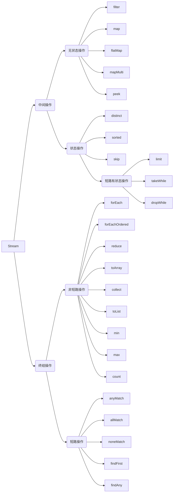

**Stream**是Java 8引入的语法特性。 是对集合（Collection）对象功能的增强，它专注于对集合对象进行各种非常便利、高效的聚合操作（aggregate operation），或者大批量数据操作 (bulk data operation)。

> 以下博文基于JAVA 17 LTS版本.

## Stream流

Stream的操作可以分为两大类：**中间操作、终结操作**

1. 中间操作
 * 无状态（Stateless）操作：指元素的处理不受之前元素的影响
 * 有状态（Stateful）操作：指该操作只有拿到所有元素之后才能继续下去
2. 终结操作
 * 短路（Short-circuiting）操作：指遇到某些符合条件的元素就可以得到最终结果
 * 非短路（Unshort-circuiting）操作：指必须处理完所有元素才能得到最终结果



## Stream 中间操作

中间操作会逐一获取元素并进行处理。可有可无。所有中间操作都是 **惰性的**，因此，**流在管道中流动之前，任何操作都不会产生任何影响**。

### 无状态操作

1. **filter**：筛选元素，按照一定的规则校验流中的元素，将符合条件的元素提取到新的流中的操作。
1. **map**: 将集合中的元素A转换成想要得到的B
1. **flatMap**: 接收一个函数作为参数，将流中的每个值都换成另一个流，然后把所有流连接成一个流。
1. peek: 操作接收的是一个 Consumer<T> 函数

```java

//    串行流和并行流设置只会有一个生效，根据调用顺序最终确定。
S sequential();    //    串行流
S parallel();    //    并行流
S unordered();    //    无序化
S onClose(Runnable closeHandler);    //    流关闭时处理

//    元素处理
Stream<T> filter(Predicate<? super T> predicate);
Stream<T> peek(Consumer<? super T> action);
<R> Stream<R> map(Function<? super T, ? extends R> mapper);
LongStream mapToLong(ToLongFunction<? super T> mapper);
DoubleStream mapToDouble(ToDoubleFunction<? super T> mapper);
<R> Stream<R> flatMap(Function<? super T, ? extends Stream<? extends R>> mapper);

//    mapMulti系列接口, Java 16增加
default <R> Stream<R> mapMulti(BiConsumer<? super T, ? super Consumer<R>> mapper) {
    Objects.requireNonNull(mapper);
    return flatMap(e -> {
        SpinedBuffer<R> buffer = new SpinedBuffer<>();
        mapper.accept(e, buffer);
        return StreamSupport.stream(buffer.spliterator(), false);
    });
}

```

### 有状态操作

1. distinct: 元素去重。（根据 Object.equals(Object), 需要重写hashCode()和equals()方法）
1. sorted：元素排序。
1. limit：获取流中n个元素返回的流。
1. skip：在丢弃流的第一个n元素之后，返回由该流的其余元素组成的流。

```java
Stream<T> distinct();
Stream<T> sorted();
Stream<T> sorted(Comparator<? super T> comparator);
Stream<T> limit(long maxSize);
Stream<T> skip(long n);

//    Java 9
default Stream<T> takeWhile(Predicate<? super T> predicate) {
        Objects.requireNonNull(predicate);
    return StreamSupport.stream(
            new WhileOps.UnorderedWhileSpliterator.OfRef.Taking<>(spliterator(), true, predicate),
            isParallel()).onClose(this::close);
}
default Stream<T> dropWhile(Predicate<? super T> predicate) {
        Objects.requireNonNull(predicate);
    return StreamSupport.stream(
            new WhileOps.UnorderedWhileSpliterator.OfRef.Dropping<>(spliterator(), true, predicate),
            isParallel()).onClose(this::close);
}
```

### Stream 终结操作

### 短路操作

1. anyMatch：Stream 中只要有一个元素符合传入的 predicate，返回 true;
1. allMatch：Stream 中全部元素符合传入的 predicate，返回 true;
1. noneMatch：Stream 中没有一个元素符合传入的 predicate，返回 true.
1. findFirst：用于返回满足条件的第一个元素（但是该元素是封装在Optional类中）
1. findAny：返回流中的任意元素（但是该元素也是封装在Optional类中）

```java
boolean anyMatch(Predicate<? super T> predicate);
boolean allMatch(Predicate<? super T> predicate);
boolean noneMatch(Predicate<? super T> predicate);
Optional<T> findFirst();
Optional<T> findAny();
```

### 非短路操作

1. forEach：该方法接收一个Lambda表达式，然后在Stream的每一个元素上执行该表达式
1. forEachOrdered：该方法接收一个Lambda表达式，然后按顺序在Stream的每一个元素上执行该表达式
1. reduce：方法接收一个函数作为累加器，数组中的每个值（从左到右）开始缩减，最终计算为一个值
1. **collect**：称为收集器，是一个终端操作,它接收的参数是将流中的元素累积到汇总结果的各种方式
1. max：根据提供的Comparator返回此流的最大元素
1. min：根据提供的Comparator返回此流的最小元素
1. count：返回此流中的元素计数

```java
void forEach(Consumer<? super T> action);
void forEachOrdered(Consumer<? super T> action);
Object[] toArray();
<A> A[] toArray(IntFunction<A[]> generator);
T reduce(T identity, BinaryOperator<T> accumulator);
Optional<T> reduce(BinaryOperator<T> accumulator);
<U> U reduce(U identity,
            BiFunction<U, ? super T, U> accumulator,
            BinaryOperator<U> combiner);
<R> R collect(Supplier<R> supplier,
            BiConsumer<R, ? super T> accumulator,
            BiConsumer<R, R> combiner);
<R, A> R collect(Collector<? super T, A, R> collector);
default List<T> toList() {
    return (List<T>) Collections.unmodifiableList(new ArrayList<>(Arrays.asList(this.toArray())));
}
Optional<T> min(Comparator<? super T> comparator);
Optional<T> max(Comparator<? super T> comparator);
long count();

```


