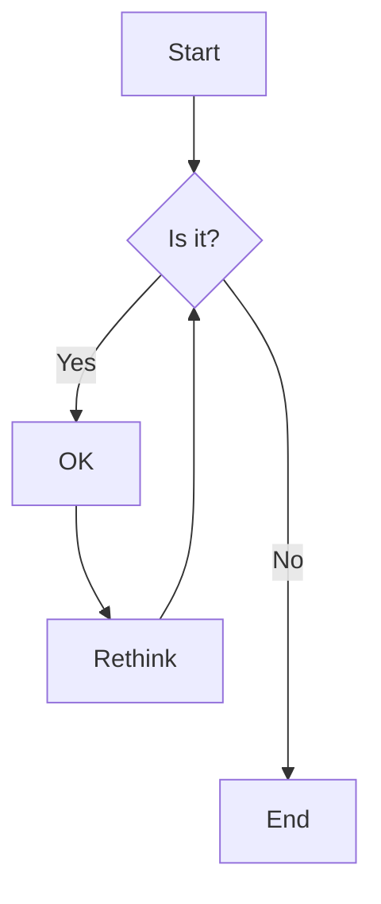
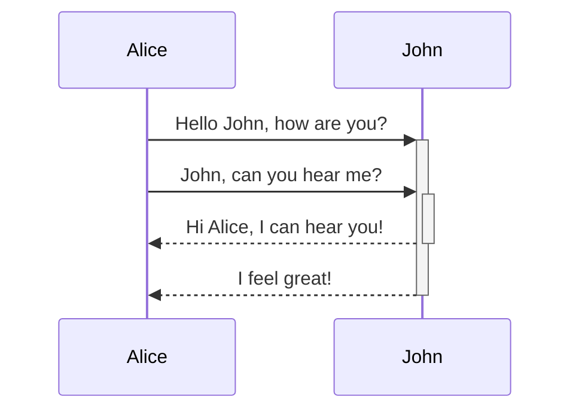

---
title: "enhancement support mermaid language code block"
published: 2021-04-20
description: "enhancement support mermaid language code block"
image: ""
tags: [copyright, creativity, neural networks, machine learning, artificial intelligence]
category: opinion
draft: false
lang: zh_CN
---

# 新增mermaid语法代码块渲染支持

